<!-- ─────────────────────────────── HEADER ─────────────────────────────── -->

  
  
  
  
  
  

 

  

 

  

## 🏢 Experience

| Role | Company | Period |
|------|---------|--------|
| 🔷 **Software Engineer Intern** | **Microsoft** | Summer 2026 · Redmond, WA |
| 🤖 **Software Engineer Intern** | **Guardiane @ USF** | May 2025 – Present · Tampa, FL |
| 💰 **Software Engineer Intern** | **FinBudAI** *(Top Startup — UpYouth TechIncubators 2024)* | Jan – May 2025 · Chicago, IL |
| 🔬 **Student Software Engineer** | **CIS Lab @ USF** | Sep 2024 – May 2025 · Tampa, FL |

## 🚀 Featured Projects

  
  

  
  

  
  

  
  

 

## 🛠️ Tech Stack

**Languages**

     

**Frontend**

    

**Backend & Data**

      

**Cloud & DevOps**

     

## 📊 GitHub Stats

  
  
    
  
    
  

